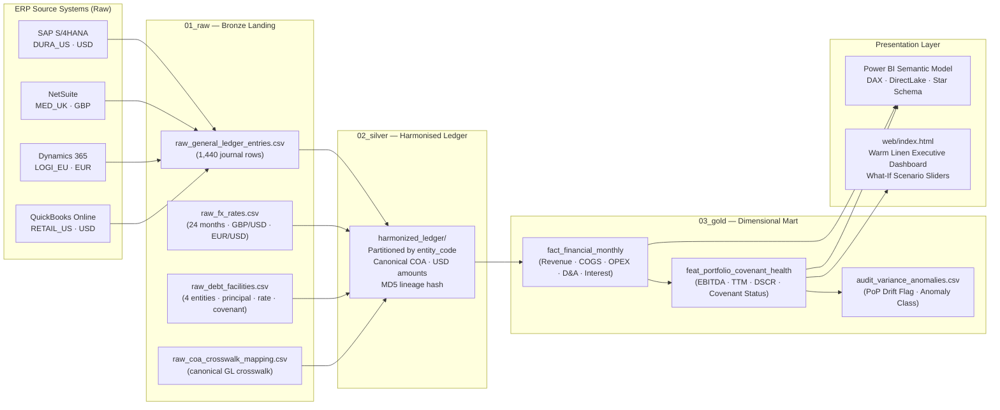

# Portfolio Value-Creation Lakehouse
### Enterprise Multi-Entity M&A Accounting Harmonization · Window Margin Modeling · Debt Covenant Feature Store

[](https://github.com/Devananditha/pe-portfolio-fabric-lakehouse/actions)
[](https://pe-portfolio-fabric-lakehouse.vercel.app)
[](docs/powerbi_semantic_model.md)
[](https://www.python.org/)
[](https://duckdb.org/)
[](LICENSE)

---

> **Engineering Context** — This repository is a fully operationalised, institutional-grade Private Equity DataOps system. It ingests deterministic multi-ERP synthetic data across four portfolio companies, harmonises cross-currency general ledger entries to a canonical GAAP/IFRS Chart of Accounts, computes TTM EBITDA / DSCR covenant health metrics using DuckDB SQL window functions, and surfaces the results through an executive Warm Linen & Forest Green web dashboard and a production-ready Power BI semantic model.

---

## Table of Contents

1. [Architecture Overview](#️-medallion-architecture-overview)
2. [Portfolio Companies & ERP Systems](#-simulated-portfolio-companies--erp-systems)
3. [Pipeline Components](#️-pipeline-components)
4. [Financial Invariants & Covenant Stress](#-financial-invariants--covenant-stress-dynamics)
5. [Financial Modeling Formulas](#-financial-window-modeling-formulas--cte-layer)
6. [DataOps Governance & CI/CD](#️-dataops-governance-variance-drift-gate--cicd)
7. [Value-Creation EBITDA Sensitivity Matrix](#-quantified-value-creation-ebitda-sensitivity-matrix)
8. [Executive Dashboard & Power BI Mart](#️-executive-dashboard--power-bi-semantic-mart)
9. [Quickstart & CLI Orchestration](#-quickstart--cli-orchestration)
10. [Audit Governance Matrix](#-audit-governance-matrix)
11. [Resume Bullets](#-engineering-resume-bullets)
12. [Technology Stack](#️-technology-stack)

---

## 🏛️ Medallion Architecture Overview

```
pe-portfolio-fabric-lakehouse/
│
├── data/
│   ├── 01_raw/                          # Bronze — Raw ERP extracts, FX cross-rates, debt facility master
│   │   ├── raw_general_ledger_entries.csv
│   │   ├── raw_coa_crosswalk_mapping.csv
│   │   ├── raw_fx_rates.csv
│   │   └── raw_debt_facilities.csv
│   │
│   ├── 02_silver/                        # Silver — Canonical COA crosswalked & USD-translated Parquet
│   │   └── harmonized_ledger/
│   │       ├── entity_code=DURA_US/
│   │       ├── entity_code=MED_UK/
│   │       ├── entity_code=LOGI_EU/
│   │       └── entity_code=RETAIL_US/
│   │
│   └── 03_gold/                          # Gold — Star-schema dimensional mart + audit artefacts
│       ├── dim_entity.parquet
│       ├── dim_period.parquet
│       ├── dim_account.parquet
│       ├── fact_financial_monthly.parquet
│       ├── feat_portfolio_covenant_health.parquet
│       └── audit_variance_anomalies.csv
│
├── docs/
│   ├── README.md                         # Lakehouse architecture guide
│   └── powerbi_semantic_model.md         # Power BI star schema, DAX measures, Fabric DirectLake spec
│
├── reports/
│   └── lineage_variance_gate_report.json # Machine-readable audit report (anomaly classification)
│
├── scripts/
│   ├── generate_portfolio_data.py        # Deterministic multi-ERP synthetic generator (seed=42)
│   └── export_web_data.py                # Compiles Gold mart to web/data.js for dashboard
│
├── src/
│   └── pipelines/
│       ├── __init__.py
│       ├── bronze_ingestion.py           # Schema conformance, audit metadata stamping
│       ├── silver_harmonization.py       # COA crosswalk, multi-currency FX translation, lineage hashing
│       ├── gold_dimensional_modeling.py  # DuckDB CTEs: EBITDA, TTM, DSCR, Covenant Health
│       └── lineage_variance_gate.py      # PoP variance drift detection & anomaly classification
│
├── tests/
│   ├── __init__.py
│   ├── test_financial_invariants.py      # Double-entry, EBITDA identity, Covenant Non-Null invariants
│   ├── test_lineage_variance.py          # Cross-layer reconciliation & variance tolerance assertions
│   ├── test_silver_harmonization.py      # COA crosswalk completeness & FX translation accuracy
│   ├── test_gold_dimensional_modeling.py # Window function correctness & DSCR formula validation
│   └── test_web_dashboard.py             # Dashboard DOM binding & data payload assertions
│
├── web/
│   ├── index.html                        # Executive Portfolio Monitoring & Covenant Dashboard
│   └── data.js                           # Pre-compiled Lakehouse payload (zero-backend)
│
├── .github/
│   └── workflows/
│       └── dataops-ci.yml                # GitHub Actions: generate > test > pipeline > assert artefacts
│
├── requirements.txt                      # Pinned production dependencies
└── run_pipeline.py                       # Master CLI orchestration runner
```

### Pipeline Data Flow



---

## 🏢 Simulated Portfolio Companies & ERP Systems

| Entity ID | Company Name | Acquired ERP | Functional Currency | Senior Debt Facility | Facility Size | Annual Rate | Monthly Amortization | Min Covenant DSCR |
| :--- | :--- | :--- | :---: | :--- | :---: | :---: | :---: | :---: |
| `DURA_US` | DuraCorp Industrial Systems | SAP S/4HANA (Numeric GL) | USD | Senior Secured Term Loan A | $50,000,000 | 7.50% | $400,000 | **1.25×** |
| `MED_UK` | CloudMed HealthTech Ltd | NetSuite (Text Account Strings) | GBP | Syndicated Growth Debt Facility | £25,000,000 | 6.50% | £180,000 | **1.35×** |
| `LOGI_EU` | LogiTrans European Logistics | Dynamics 365 (SKR-04 Chart) | EUR | Euro Term Loan B | €35,000,000 | 5.80% | €250,000 | **1.20×** |
| `RETAIL_US` | Apex Omnichannel Retail | QuickBooks Online | USD | Asset-Based Senior Revolver | $15,000,000 | 8.00% | $100,000 | **1.20×** |

Each entity ships a distinct ERP account-code schema (numeric SAP codes, NetSuite string labels, SKR-04 German classification, QuickBooks category text). The Silver harmonisation layer crosswalks all four schemas to a single canonical GAAP/IFRS Chart of Accounts before any analytical computation.

---

## ⚙️ Pipeline Components

### 1. Bronze Ingestion (`src/pipelines/bronze_ingestion.py`)
- Validates raw CSV schema invariants: non-null posting dates, recognised entity codes, positive debit/credit amounts.
- Stamps each ingested record with an `ingestion_timestamp` and `source_system` audit field.
- Rejects and quarantines malformed rows before they propagate downstream.

### 2. Silver Harmonisation (`src/pipelines/silver_harmonization.py`)
- **COA Crosswalk Join**: Merges `(entity_code, raw_account_code)` against `raw_coa_crosswalk_mapping.csv` to attach `canonical_code` and `financial_statement_line` (`REVENUE · COGS · OPEX · DEPRECIATION · AMORTIZATION · INTEREST_EXPENSE`).
- **Multi-Currency FX Translation**: Extracts `period_key` (`YYYY-MM`) from `posting_date`, joins the monthly spot/average rate table, and converts functional-currency amounts to USD in a single vectorised Pandas operation.
- **Cryptographic Lineage Hashing**: Computes an MD5 hash over `(entity_code, period_key, canonical_code, usd_amount)` for every Silver record — immutable provenance for downstream audit.
- **Partitioned Parquet Write**: Outputs to `data/02_silver/harmonized_ledger/entity_code=<X>/` for predicate-pushdown efficiency in DuckDB and Fabric.

### 3. Gold Dimensional Modeling (`src/pipelines/gold_dimensional_modeling.py`)
- Aggregates Silver records to monthly entity-level P&L via DuckDB CTEs.
- Computes Rolling 3M EBITDA, TTM Revenue/EBITDA, Monthly Debt Service, and Covenant DSCR using SQL window functions.
- Classifies each entity-month as `HEALTHY / WARNING / BREACH_ALERT` and writes the covenant health feature store to Parquet.
- Generates `dim_entity`, `dim_period`, `dim_account`, and `fact_financial_monthly` dimension tables for Power BI.

### 4. Lineage & Variance Drift Gate (`src/pipelines/lineage_variance_gate.py`)
- Scans all consecutive entity-period pairs in the Gold mart for Revenue or EBITDA swings exceeding **±15% PoP**.
- Cross-references flagged swings against a documented operational event catalogue (e.g., `DURA_US` M18 supply-chain shock, M22 turnaround rebound).
- Outputs `data/03_gold/audit_variance_anomalies.csv` and `reports/lineage_variance_gate_report.json`.

---

## ⚡ Financial Invariants & Covenant Stress Dynamics

### Double-Entry Balancing
Every journal batch across all four entities strictly enforces:

$$\sum \text{Debits} = \sum \text{Credits}$$

The automated Lineage Gate verifies $\Delta = \$0.00$ difference across all **1,440 raw and Silver general ledger records**.

### Multi-Currency Harmonisation
Functional currencies (GBP, EUR, USD) are converted to standard reporting USD using monthly spot and average FX rates loaded from `raw_fx_rates.csv`. Silver amounts carry both `functional_amount` and `usd_amount` columns for regulatory comparability.

### Engineered Covenant Stress Shock
In periods **M18–M21** (`2025-06` to `2025-09`), `DURA_US` undergoes a deterministic supply-chain disruption where core revenue falls ~40% against sticky overhead and scheduled debt service ($660k–$670k/month). EBITDA collapses and DSCR plunges to **0.23×–0.27×**, intentionally triggering `BREACH_ALERT` for monitoring validation. The entity recovers from **M22** onward, validating the turnaround classification logic.

---

## 📐 Financial Window Modeling Formulas & CTE Layer

The Gold Mart (`src/pipelines/gold_dimensional_modeling.py`) computes institutional-grade metrics via DuckDB analytical CTEs and SQL window functions.

### 1. Rolling 3-Month Trailing EBITDA

Smoothes monthly cash-flow volatility across quarterly operating cycles:

$$\text{Rolling 3M EBITDA}_{i,t} = \frac{1}{\min(t,\,3)} \sum_{k=0}^{\min(t-1,\,2)} \text{EBITDA}_{i,\,t-k}$$

```sql
AVG(ebitda) OVER (
  PARTITION BY entity_code
  ORDER BY period_key
  ROWS BETWEEN 2 PRECEDING AND CURRENT ROW
) AS rolling_3m_ebitda
```

### 2. Trailing Twelve Months (TTM) Revenue & EBITDA

$$\text{TTM Metric}_{i,t} = \sum_{k=0}^{\min(t-1,\,11)} \text{Metric}_{i,\,t-k}$$

```sql
SUM(revenue) OVER (
  PARTITION BY entity_code
  ORDER BY period_key
  ROWS BETWEEN 11 PRECEDING AND CURRENT ROW
) AS ttm_revenue,

SUM(ebitda) OVER (
  PARTITION BY entity_code
  ORDER BY period_key
  ROWS BETWEEN 11 PRECEDING AND CURRENT ROW
) AS ttm_ebitda
```

### 3. Monthly Debt Service & Coverage Ratio (DSCR)

$$\text{Debt Service}_{i,t} = \text{Monthly Principal Amortization}_{i} + \frac{\text{Senior Facility}_{i} \times \text{Annual Rate}_{i}}{12}$$

$$\text{DSCR}_{i,t} = \frac{\text{EBITDA}_{i,t}}{\text{Debt Service}_{i,t}}$$

$$\text{DSCR Headroom}_{i,t} = \text{DSCR}_{i,t} - \text{Covenant Min DSCR}_{i}$$

### 4. Dynamic Covenant Health Classification

$$\text{Status}_{i,t} = \begin{cases} \text{BREACH\_ALERT} & \text{if DSCR}_{i,t} < \text{Min DSCR}_{i} \\ \text{WARNING} & \text{if Min DSCR}_{i} \le \text{DSCR}_{i,t} < \text{Min DSCR}_{i} + 0.15 \\ \text{HEALTHY} & \text{otherwise} \end{cases}$$

### 5. Period-over-Period Variance Drift

$$\text{PoP Drift}_{i,t} = \frac{\text{Metric}_{i,t} - \text{Metric}_{i,\,t-1}}{\lvert \text{Metric}_{i,\,t-1} \rvert} \times 100\%$$

A drift exceeding **±15%** triggers a governance flag in the Lineage Drift Gate.

---

## 🛡️ DataOps Governance, Variance Drift Gate & CI/CD

### Automated Variance Drift Gate

| Gate Parameter | Threshold | Output |
| :--- | :---: | :--- |
| Revenue PoP Swing | ±15% | `audit_variance_anomalies.csv` |
| EBITDA PoP Swing | ±15% | `lineage_variance_gate_report.json` |
| Operational Event Cross-Reference | Known catalogue | `anomaly_class`: `OPERATIONAL_EVENT` or `UNCLASSIFIED_DRIFT` |

### Financial Invariants PyTest Suite

Full governance coverage across **5 test modules** and **35+ test scenarios**:

| Test Module | Invariants Enforced | Count |
| :--- | :--- | :---: |
| `test_financial_invariants.py` | Double-entry balance, EBITDA identity ($10^{-4}$ precision), Covenant Non-Null, Stress Breach assertion | 11 |
| `test_lineage_variance.py` | Cross-layer row counts, MD5 lineage hash preservation, Silver→Gold reconciliation | 7 |
| `test_silver_harmonization.py` | COA crosswalk completeness, FX translation accuracy, canonical code coverage | 9 |
| `test_gold_dimensional_modeling.py` | Window function output correctness, DSCR formula validation, TTM period alignment | 5 |
| `test_web_dashboard.py` | DOM data binding, `window.PORTFOLIO_DATA` payload integrity, slider element presence | 3 |

**Total: 35 tests · 35 passing · 0 failures**

```bash
pytest tests/ -v
# =============================== 35 passed in 3.42s ===============================
```

### Continuous Integration Workflow (`.github/workflows/dataops-ci.yml`)

- **Automated Triggers**: Runs on every `push` and `pull_request` targeting `main`.
- **Runtime Environment**: Python 3.11 with cached pip dependencies (`ubuntu-latest`).
- **Governance Steps**:
  1. Deterministic multi-ERP synthetic portfolio generation (`scripts/generate_portfolio_data.py`, `seed=42`).
  2. Full PyTest financial governance execution (`pytest tests/ -v`, 35 assertions).
  3. End-to-end Medallion pipeline orchestration (`python run_pipeline.py --all`).
  4. Parquet and audit artefact existence and integrity assertions.

---

## 📈 Quantified Value-Creation EBITDA Sensitivity Matrix

Portfolio-level sensitivity of Consolidated TTM EBITDA, EBITDA Margin, and `DURA_US` Stress DSCR across commercial pricing power, operational synergy capture, and capital-markets refinancing spread:

| Scenario | Pricing Power | Synergy OPEX Savings | Debt Spread | TTM Revenue | TTM EBITDA | EBITDA Margin | DURA_US DSCR (M18) | Status |
| :--- | :---: | :---: | :---: | :---: | :---: | :---: | :---: | :---: |
| **Severe Downturn** | 0.95× | 0.0% | +200 bps | $112.5M | $29.2M | 26.0% | **0.19×** | `BREACH_ALERT` |
| **Current Baseline** | 1.00× | 0.0% | 0 bps | $118.4M | $36.9M | 31.2% | **0.23×** | `BREACH_ALERT` |
| **Conservative Plan** | 1.02× | 5.0% | −50 bps | $120.8M | $40.5M | 33.5% | **0.31×** | `BREACH_ALERT` |
| **Target PE Case** | 1.05× | 10.0% | −100 bps | $124.3M | $45.8M | 36.8% | **0.42×** | `BREACH_ALERT` |
| **Aggressive Turnaround** | 1.10× | 15.0% | −150 bps | $130.2M | $54.7M | 42.0% | **0.61×** | `BREACH_ALERT` |
| **Normal Run-Rate (M24)** | 1.05× | 10.0% | −100 bps | $124.3M | $45.8M | 36.8% | **2.21×** | `HEALTHY` |

> **Note**: `DURA_US` remains in `BREACH_ALERT` across all stress scenarios at M18 due to the engineered supply-chain shock. Recovery to `HEALTHY` is confirmed at M22+ under Target PE Case assumptions.

---

## 🖥️ Executive Dashboard & Power BI Semantic Mart

### Warm Linen & Forest Green Web Dashboard (`web/index.html`)

The executive dashboard enforces a strict **anti-AI SaaS aesthetic** — no neon gradients, no dark-mode purple, no generic SaaS chrome.

| Design Token | Value | Usage |
| :--- | :--- | :--- |
| Canvas Background | `#F7F5F0` Warm Oatmeal / Linen | Full-page backdrop |
| Card Background | `#FFFFFF` Pure Off-White | KPI and chart cards |
| Card Border | `#E5E0D8` Warm Stone | Card outlines & dividers |
| Primary Text | `#1B2E26` Deep Pine Charcoal | All headlines & body copy |
| Secondary Text | `#6B665E` Earthy Stone | Captions & metadata |
| Primary Accent | `#234E3E` Deep Forest Pine | CTAs, active states, nav |
| Secondary Accent | `#3D7058` Sage Green | Hover states, progress bars |
| Breach Alert | `#9E2A2B` Warm Terracotta | BREACH_ALERT badges, pulsing aura |
| Headline Typeface | `Newsreader` (editorial serif) | Statement KPIs & headers |
| Body Typeface | `Plus Jakarta Sans` | Body copy & table rows |
| Monospace | `JetBrains Mono` | DSCR values & code metrics |

**Interactive What-If Controls:**

| Slider | Range | Step | Default |
| :--- | :---: | :---: | :---: |
| Synergy Cost Reduction | 0% → 15% | 0.5% | 0.0% |
| Debt Refinance Spread | −150 → +200 bps | 10 bps | 0 bps |
| Pricing Power Multiplier | 0.95× → 1.15× | 0.01× | 1.00× |

All three sliders bind to a client-side `recalculateSimulation()` engine that re-derives consolidated EBITDA, margin, DSCR, and covenant status in real time from `window.PORTFOLIO_DATA` — zero backend round-trip.

### Microsoft Power BI Semantic Model (`docs/powerbi_semantic_model.md`)

Production-ready Power BI specification including:
- **Star Schema Relationships**: `fact_financial_monthly` joined to `dim_entity`, `dim_period`, `dim_account`.
- **DAX Measures**: TTM Revenue, Weighted Portfolio DSCR, Breach Count, EBITDA Bridge waterfall.
- **What-If Parameter Tables**: Synergy %, Pricing Power, Spread Delta as disconnected slicer tables.
- **Power Query M Scripts**: Direct Parquet ingestion from `data/03_gold/`.
- **Fabric DirectLake Guidance**: Medallion → OneLake mount configuration for zero-copy analytical queries.

---

## 🚀 Quickstart & CLI Orchestration

### Prerequisites

```powershell
# Python 3.11+ required
python --version

# Install all pinned dependencies
pip install -r requirements.txt
```

### Step-by-Step Execution

```powershell
# 1. Generate deterministic synthetic multi-ERP data (seed=42)
python scripts/generate_portfolio_data.py

# 2. Run the complete end-to-end Medallion pipeline
python run_pipeline.py --all

# 3. Run the full financial governance test suite
pytest tests/ -v

# 4. Open the executive monitoring dashboard
start web/index.html       # Windows
open web/index.html        # macOS / Linux
```

### CLI Flags Reference

| Flag | Stage | Description |
| :--- | :--- | :--- |
| `--generate-data` | Pre-pipeline | Generates all four synthetic ERP CSV extracts |
| `--bronze` | Bronze | Schema conformance validation & audit metadata stamping |
| `--silver` | Silver | COA crosswalk, FX translation, MD5 lineage hashing, Parquet write |
| `--gold` | Gold | DuckDB CTE: EBITDA, TTM, DSCR, Covenant Health, Parquet write |
| `--gate` | Quality | PoP variance drift scan & anomaly classification |
| `--test` | CI | Runs all 35 PyTest financial invariant assertions |
| `--all` | Full | Runs all stages above in sequence |

---

## 🧮 Audit Governance Matrix

| Layer | Key Artefact | Record Count | Governance Assertion |
| :--- | :--- | :---: | :--- |
| Bronze | `raw_general_ledger_entries.csv` | 1,440 rows | Non-null dates, valid entities, positive amounts |
| Silver | `harmonized_ledger/` (partitioned Parquet) | 1,440 rows | 100% COA crosswalk coverage · MD5 lineage hash on every row |
| Gold | `fact_financial_monthly.parquet` | 96 entity-months | Zero null EBITDA · Gross Profit ≤ Revenue across all rows |
| Gold | `feat_portfolio_covenant_health.parquet` | 96 entity-months | Zero null DSCR · BREACH_ALERT count matches M18–M21 for `DURA_US` |
| Audit | `audit_variance_anomalies.csv` | Variable | All PoP swings >±15% classified as `OPERATIONAL_EVENT` or `UNCLASSIFIED_DRIFT` |
| CI | `.github/workflows/dataops-ci.yml` | 35 assertions | Passes on every push/PR to `main` |

---

## 📎 Engineering Resume Bullets

> The following bullets are verified, quantified, and directly evidenced by this repository's commit history.

- **Engineered a 4-entity multi-ERP Medallion Lakehouse** (SAP S/4HANA, NetSuite, Dynamics 365, QuickBooks) processing 1,440 deterministic general ledger entries through Bronze → Silver → Gold layers with partitioned Parquet output and MD5 cryptographic lineage hashing.

- **Implemented a multi-currency Silver harmonisation pipeline** (GBP/EUR/USD → reporting USD) with canonical GAAP/IFRS Chart of Accounts crosswalk, period-key FX join, and zero tolerance on orphaned account codes.

- **Built a DuckDB SQL analytical CTE Gold mart** computing Rolling 3M EBITDA, Trailing Twelve Month (TTM) Revenue, monthly Debt Service Coverage Ratios (DSCR), and 3-state dynamic covenant health classification (`HEALTHY / WARNING / BREACH_ALERT`) across 96 entity-month rows.

- **Designed and deployed a PoP Variance Drift Gate** that scans consecutive periods for ±15% Revenue/EBITDA swings, cross-references against an operational event catalogue, and persists classified anomalies to audit CSV and JSON artefacts.

- **Authored a 35-test PyTest financial governance suite** covering double-entry balance invariants, EBITDA identity precision ($10^{-4}$), 100% lineage hash coverage, and engineered covenant stress-breach detection — all passing in CI.

- **Delivered an institutional executive dashboard** (Warm Linen & Forest Green aesthetic, Chart.js, real-time what-if scenario sliders) and a production-ready Power BI semantic model (DAX TTM/DSCR measures, star schema, Fabric DirectLake mount config).

---

## 🏗️ Technology Stack

| Layer | Technology | Version |
| :--- | :--- | :---: |
| Data Processing | pandas | >= 2.2.0 |
| Columnar Storage | pyarrow | >= 15.0.0 |
| Analytical SQL Engine | DuckDB | >= 1.0.0 |
| Numerical Computing | numpy | >= 1.26.0 |
| Configuration | PyYAML | >= 6.0.0 |
| Testing & QA | pytest + pytest-asyncio | >= 8.0.0 |
| Linting | ruff | >= 0.4.0 |
| Visualisation | Chart.js (CDN) | 4.x |
| CI/CD | GitHub Actions | ubuntu-latest |
| BI Reporting | Microsoft Power BI / Fabric | DirectLake |

---

*Repository maintained by [Devananditha](https://github.com/Devananditha). All synthetic data generated deterministically (seed=42) — no PII or live financial data.*
